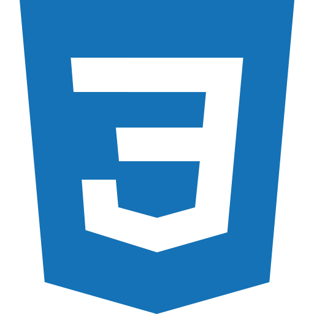
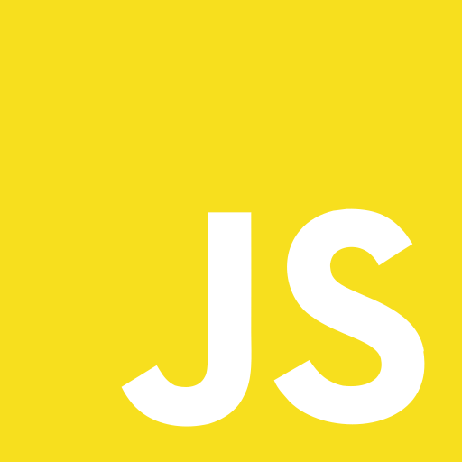
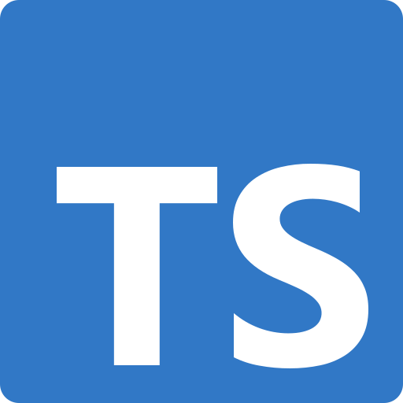
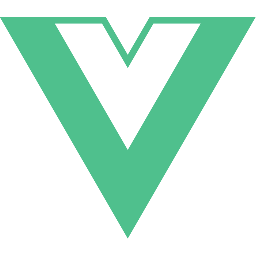
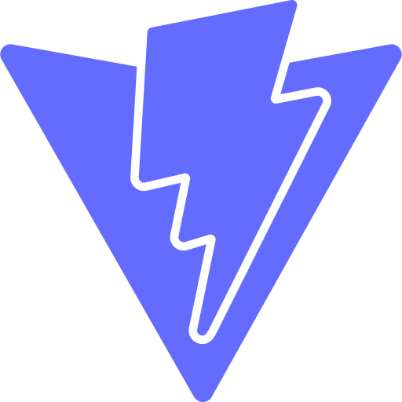
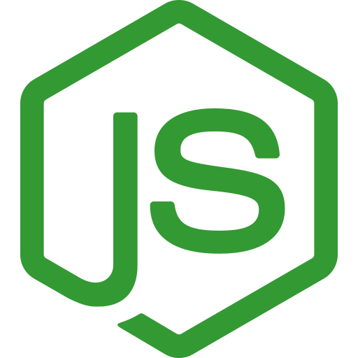
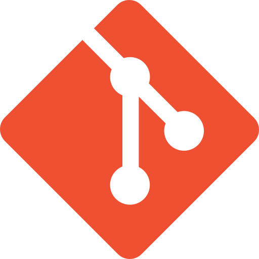

# Olá, Hello, Salut, やあ! 👋
Oi, eu sou o André!

Comecei a me interessar com desenvolvimento web ainda na faculdade, quando pensava em criar um site para me apresentar. Atualmente, atuo na área de Marketing Digital, em Curitiba, e estou desenvolvendo minhas habilidades em front-end gradualmente. Já conto com projetos que você pode apreciar através dos meus repositórios no GitHub.

## Sobre mim 👨🏽‍💻
Trabalho principalmente com o Marketing B2B (empresa-para-empresa). Tenho conhecimentos no Gerenciador de Anúncios Meta, GA4, UTMs, GTM, Google Looker Studio (antigo Google Data Studio), Google Apps Script e nas ferramentas do Google Workspace. Meus conhecimentos também se estendem para criação e acompanhamento de estratégias de Marketing Digital, SEO, SEM, Inbound Marketing e Customer Success.

Além de aprender rápido, tenho carinho pelo que faço, muita curiosidade, perseverança, consigo encontrar soluções por conta e consigo apresentar minha linha de pensamento de maneira clara e documentá-la bem. Gosto de trabalho em equipe, cooperação, de me envolver em novos projetos e um ambiente de trabalho transparente.

Sou nativo brasileiro, falo inglês ao nível profissional (C2) e estou aprendendo japonês (<N5).

> EN: I'm a native Brazilian, I speak English at a professional level (C2) and I'm currently learning Japanese (<N5).

> JP: 私はブラジル人です。英語はプロフェッショナルレベル(C2)で話せます。日本語を勉強しています (<N5)。

## Habilidades 🎯
Tenho conhecimentos em HTML5, CSS3, JavaScript (ES6), Apps Script, JSON e REST API, além de JavaScript frameworks como Vue 3 e supersets como TypeScript e Nuxt 3. Utilizo o Google Cloud Platform (GCP) em alguns de meus projetos, via Firebase (JS SDK v9). Também possuo conhecimentos básicos sobre Node.js, Webpack, Vite e SQL, além de Git e GitHub.

  
  
  
  
  
  
  
  
  
  
  

## Contato
Você pode entrar em contato através do [meu site para freelance](https://andremourasantos.com.br/desenvolvimento-web/?utm_source=github&utm_medium=readme_perfil), e-mail profissional ou perfil no LinkedIn. Veja também o [meu portfólio](https://andremourasantos.com.br/portfolio/?utm_source=github&utm_medium=readme_perfil) para notar os meus projetos já desenvolvidos.

- 📬 [contato@andremourasantos.com.br](mailto:contato@andremourasantos.com.br?subject=Contato&body=Ol%C3%A1%2C%20Andr%C3%A9!%0D%0A%0D%0AVi%20seu%20perfil%20no%20GtHub%20e%20gostaria%20de%20entrar%20em%20contato%20para%20conversar%20sobre...)
- 💼 [Perfil no LinkedIn](https://linkedin.com/in/andremourasantos/)